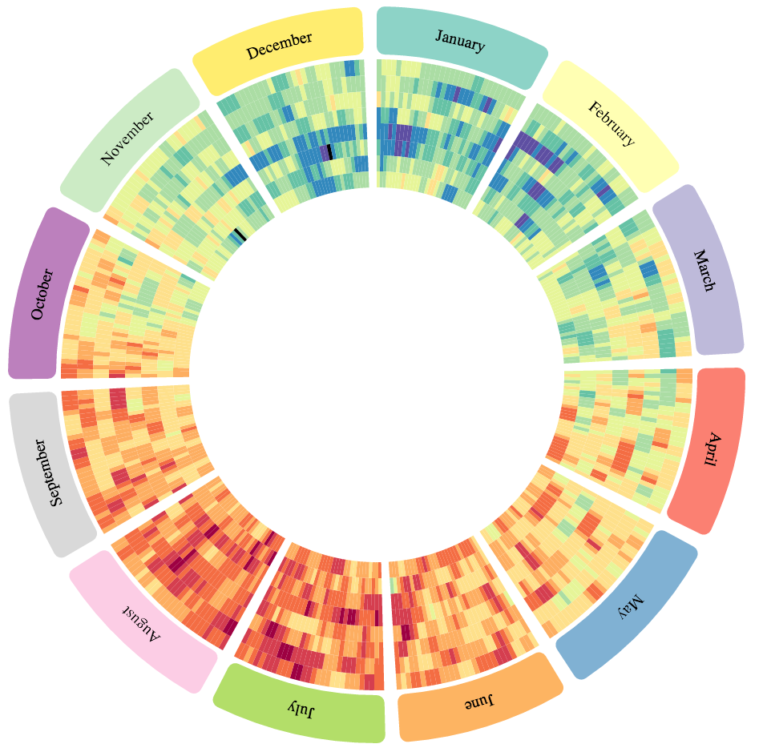
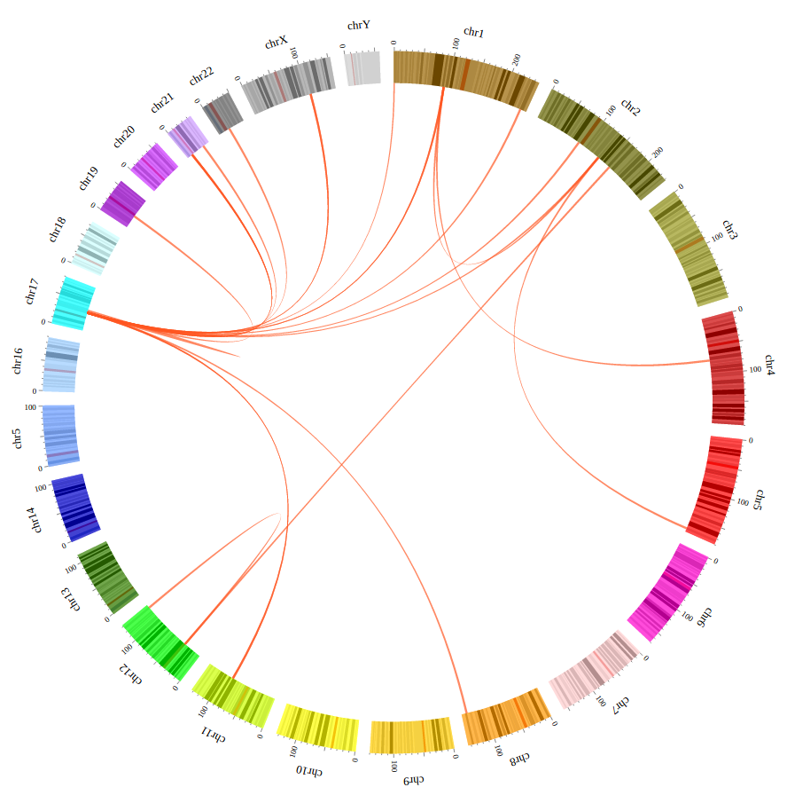

# Circos [](https://circleci.com/gh/nicgirault/circosJS)

## table of contents

- [Introduction](#Introduction)
- [Installation](#Installation)
- [Layout](#Layout)
- [Tracks](#Tracks)
  - [Chords](#Chords)

## Introduction

Circos is a javascript library to easily build interactive graphs in a circular layout. It's based on [d3.js](https://d3js.org/). It aims to be a javascript version of the [Circos](http://circos.ca) software.

You should consider using Circos to show:

- relationships between entities
- periodical data



*Average temperatures in Paris from 2007 (inner) to 2014 (outer). The circular layout highlights seasonal effect.*

## Installation

If you don't know what is yarn or npm you can skip this step and get started with [this canvas](doc/canvas.html). Otherwise:

```
yarn install circosjs
```

## Layout

To instantiate a new circos:

```javascript
var myCircos = new Circos({
    container: '#chart',
    width: 500,
    height: 500,
});
```

A circos graph is based on a circular axis **layout**. Data tracks appear inside and/or outside the circular layout.

In order to place data on the circos graph, you must first specify the layout.

```javascript
myCircos.layout(configuration, data);
```

The first argument of the `layout` function is a configuration object that control the format of the layout.

Here are the default parameters for a layout:

```javascript
var configuration = {
  innerRadius: 250,
  outerRadius: 300,
  cornerRadius: 10,
  gap: 0.04, // in radian
  labels: {
    display: true,
    position: 'center',
    size: '14px',
    color: '#000000',
    radialOffset: 20,
  },
  ticks: {
    display: true,
    color: 'grey',
    spacing: 10000000,
    labels: true,
    labelSpacing: 10,
    labelSuffix: 'Mb',
    labelDenominator: 1000000,
    labelDisplay0: true,
    labelSize: '10px',
    labelColor: '#000000',
    labelFont: 'default',
    majorSpacing: 5,
    size: {
      minor: 2,
      major: 5,
    }
  },
  clickCallback: null
}
```

The second argument of the `layout` function is an array of data that describe the layout regions. Each layout region must have an id and a length. You can also specify a color and a label.

```javascript
var data = [
  { len: 31, color: "#8dd3c7", label: "January", id: "january" },
  { len: 28, color: "#ffffb3", label: "February", id: "february" },
  { len: 31, color: "#bebada", label: "March", id: "march" },
  { len: 30, color: "#fb8072", label: "April", id: "april" },
  { len: 31, color: "#80b1d3", label: "May", id: "may" },
  { len: 30, color: "#fdb462", label: "June", id: "june" },
  { len: 31, color: "#b3de69", label: "July", id: "july" },
  { len: 31, color: "#fccde5", label: "August", id: "august" },
  { len: 30, color: "#d9d9d9", label: "September", id: "september" },
  { len: 31, color: "#bc80bd", label: "October", id: "october" },
  { len: 30, color: "#ccebc5", label: "November", id: "november" },
  { len: 31, color: "#ffed6f", label: "December", id: "december" }
]
```

The `id` parameter will be used to place data points on the layout.

To visualize the result:

```javascript
myCircos.render();
```


## Tracks

A track is a series of data points.

To add a track to your graph you should write something like this:

```javascript
instance.heatmap(
    'my-heatmap',
    {
        // your heatmap configuration
    },
    data
);
```

This pattern is similar to all track types:

```javascript
instance.trackType('track-id', configuration, data);
```

**Note**: The track name is used as a HTML class name so here are the format limitations.

* Must be unique.
* Should be slug style for simplicity, consistency and compatibility. Example: `heatmap-1`
* Lowercase, a-z, can contain digits, 0-9, can contain dash or dot but not start/end with them.
* Consecutive dashes or dots not allowed.
* 50 characters or less.


### Chords

Chords tracks connect layout regions.



*Gene fusions in human karyotype [source](http://cancer.sanger.ac.uk/cosmic/download). [See full example](doc/chords.md)*

Data should looks like this:

```javascript
var data = [
    // sourceId, sourceStart, sourceEnd, targetId, targetStart, targetEnd
    ['january', 1, 12, 'april', 18, 20],
    ['february', 20, 28, 'december', 1, 13],
];
```

Optionally each datum can define a seventh element which can be used to be interpreted as a `value` to draw colored ribbons with palettes or a color function.

The default configuration is:

```javascript
{
  color: '#fd6a62',
  opacity: 0.7,
  zIndex: 1,
  tooltipContent: null,
  usePalette: false,
  colorPaletteSize: 9,
  colorPalette: 'PuBuGn',
  colorPaletteReverse: false,
  min: 'smart',
  max: 'smart',
  logScale: false,
  logScaleBase: Math.E,
}
```

### Heatmap

### Stack

### Highlight

### Histogram

### Line

### Scatter

### Text

## Palettes

https://github.com/d3/d3-scale-chromatic

## Min/Max

You can specify the min and max values of the dataset. If `'smart'` is used, the minimum and maximum will fit the range of values of the dataset.

## Custom datum formatting

## Contact

Nicolas Girault
nic.girault@gmail.com

Your feedbacks are welcome. If you're struggling using the librairy, the best way to ask questions is to use the Github issues so that they are shared with everybody.
